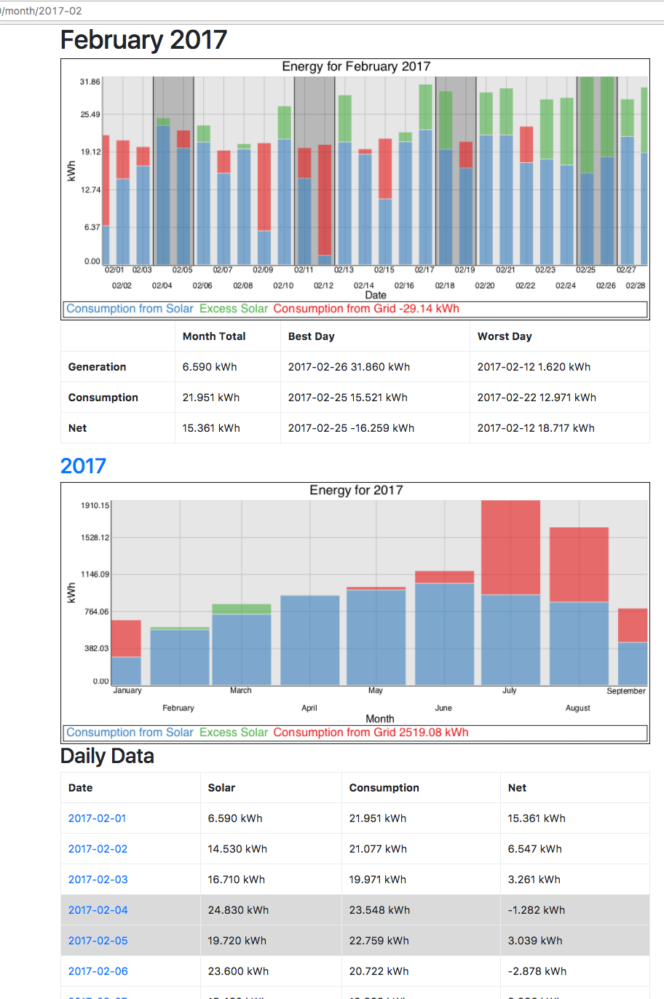

# solar_ng

This is a simple webapp for viewing consumption and generation data for a grid tied residential solar install.

Data is pulled from a DB (a SQLite example is included).



## Dependencies

 * Perl
 * Mojolicious
 * Chart::Clicker
 * DateTime
 * dbd::SQLite
 
These are available on Debian derrived systems by asking apt to install:
```
  libmojolicious-perl libdatetime-perl libdbd-sqlite3 libchart-clicker-perl
```

## Contributing
Yes, Please.

Would love contributions for this project.  I'm using it for my home system but felt others might be able to benifit from it.  I would especially love help making it look pretty.

## Running

With the dependencies installed cd to the repo and run `./script/solar_ng daemon` it will start up listening at http://localhost:3000.

